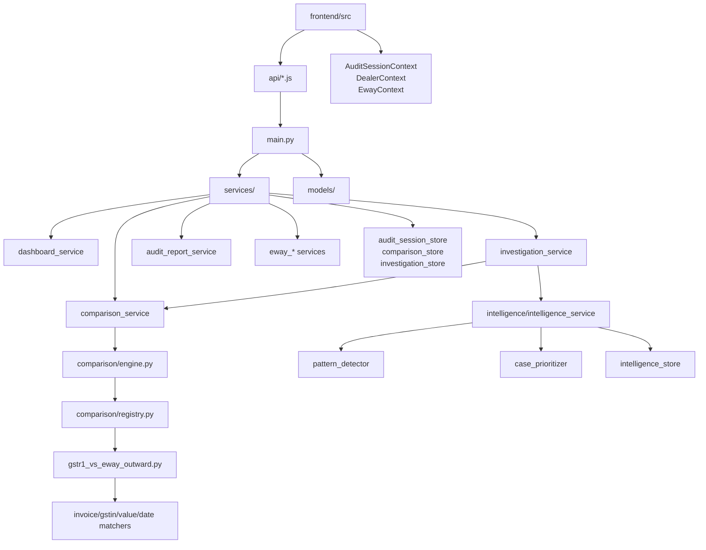

# GAIS Architecture

**GAIS** (GST Audit Intelligence System) is a full-stack application for merging GST return workbooks, running cross-dataset comparisons, investigating discrepancies, and generating audit reports. The product name shown in the UI is *Excel Merger for GST Audit*; internally and in documentation we refer to the platform as **GAIS**.

## System Overview

```
┌─────────────────────────────────────────────────────────────────────────┐
│                         Browser (React 19 + Vite)                        │
│  Dashboard │ Merge │ Workbook │ Comparison │ Investigation │ Report     │
│  Job Queue panel ← WebSocket /ws/jobs/{session_id}                      │
└───────────────────────────────┬─────────────────────────────────────────┘
                                │ REST (JSON / multipart / 202 job responses)
                                ▼
┌─────────────────────────────────────────────────────────────────────────┐
│                    FastAPI Backend (Python 3.11)                         │
│  main.py ──► services/ ──► job queue ──► worker ──► executors           │
│              stores/ ──► repositories/ ──► PostgreSQL                   │
│              comparison/ │ intelligence/ │ models/                      │
└───────────────────────────────┬─────────────────────────────────────────┘
                                │
              ┌─────────────────┴─────────────────┐
              ▼                                   ▼
     DATABASE_PROVIDER=memory              DATABASE_PROVIDER=postgres
     (in-process dicts)                    (SQLAlchemy 2.x + Alembic)
```

| Layer | Technology | Location |
|-------|------------|----------|
| Frontend | React 19, Vite 8, Tailwind CSS 3, React Router 7 | `frontend/` |
| Backend | FastAPI, Pydantic v2, SQLAlchemy 2.x, pandas, openpyxl | `backend/` |
| E2E tests | Playwright | `e2e/` |
| Deployment | Docker Compose, Nginx reverse proxy | `docker-compose.yml`, `frontend/nginx.conf` |

Default dev URLs:

- Frontend: `http://127.0.0.1:5173`
- Backend API: `http://127.0.0.1:8000`
- OpenAPI docs: `http://127.0.0.1:8000/docs`

## Folder Structure (High Level)

```
gstaudit/
├── backend/           # FastAPI application
│   ├── main.py        # HTTP routes (single entry point)
│   ├── merger.py      # GSTR-1 / GSTR-2A Excel merge logic
│   ├── comparison/    # Pluggable comparison engine
│   ├── intelligence/  # Pattern detection, prioritization, insights
│   ├── models/        # Pydantic domain models
│   ├── services/      # Orchestration, stores, report export
│   ├── repositories/  # Memory + PostgreSQL repository implementations
│   ├── db/            # SQLAlchemy ORM models, mappers, session
│   ├── alembic/       # Database migrations
│   └── tests/         # pytest suite
├── frontend/          # React SPA
│   └── src/
│       ├── pages/     # Route-level screens
│       ├── components/# Feature and layout components
│       ├── context/   # React context providers
│       └── api/       # Fetch wrappers per domain
├── e2e/               # Playwright specs + helpers
└── docs/              # Project documentation (this folder)
```

See [FOLDER_STRUCTURE.md](./FOLDER_STRUCTURE.md) for the complete tree.

## Core Data Flows

### 1. Upload & Merge Flow

```
User selects files → POST /api/merge/gstr1|gstr2a|eway/*
                  → Backend merges Excel (merger.py / eway_merge_service.py)
                  → Response: merged workbook + X-Workbook-Metadata header
                  → Frontend: AuditSessionContext.recordMerge()
                  → POST /api/session/sync (debounced)
                  → Dashboard aggregates via dashboard_service.build_dashboard()
```

Session identity is derived from `{GSTIN}:{financial_year}` and hashed to `session_<hex>` (see `frontend/src/types/auditSession.js` and backend session store).

### 2. Comparison Flow

```
Both GSTR-1 + EWB Outward merged → comparison_status = "ready"
User runs comparison → POST /api/comparison/gstr1-eway
                     → comparison_service.run_gstr1_eway_comparison()
                     → ComparisonEngine.run("gstr1_ewb_outward", ...)
                     → Result saved to comparison_store
                     → Session discrepancies + comparison_status updated
Investigation cases synced lazily on GET /api/investigation
Intelligence computed on GET /api/intelligence (cached)
```

### 3. Investigation Flow

```
Comparison discrepancies → investigation_service.sync_cases_from_comparison()
                         → One InvestigationCase per non-MATCHED record
                         → Intelligence enrichment (priority, patterns, docs)
Officer updates → PATCH /api/investigation/{case_id}
Bulk actions    → POST /api/investigation/bulk
```

### 4. Audit Report Flow

```
GET /api/report/preview  → Structured preview (executive summary + intelligence)
POST /api/report/generate → Excel / PDF / DOCX via audit_report_service
Legacy dealer-only reports → POST /api/reports/excel|pdf (report_export.py)
```

## Module Dependency Graph



## Audit Session as Central Aggregate

`AuditSession` (`backend/models/audit_session.py`) is the canonical workflow container:

| Field | Purpose |
|-------|---------|
| `session_id` | Stable ID from GSTIN + FY |
| `dealer` | `DealerMetadata` (GSTIN, legal name, FY) |
| `datasets` | Per-module upload/merge state (gstr1, gstr2a, ewb_outward, ewb_inward) |
| `upload_history` | Chronological upload log |
| `comparison_status` | Pair readiness (gstr1_ewb_outward, gstr2a_ewb_inward) |
| `discrepancies` | Rolled-up counts from last comparison |
| `audit_status` | draft → in_progress → ready → completed |

The frontend mirrors session state in `localStorage` (`gst_audit_session`) and syncs to the backend with a 400 ms debounce.

## Comparison Pairs (Planned vs Implemented)

| Pair ID | Left | Right | Status |
|---------|------|-------|--------|
| `gstr1_ewb_outward` | GSTR-1 | EWB Outward | **Implemented** — registered in `comparison/bootstrap.py` |
| `gstr2a_ewb_inward` | GSTR-2A | EWB Inward | Comparator stub exists (`gstr2a_vs_eway_inward.py`); not registered in bootstrap |

Future comparators register via `comparison_registry.register(...)` without modifying `ComparisonEngine`.

## Frontend Route Map

| Path | Page | Primary API |
|------|------|-------------|
| `/` | `Dashboard.jsx` | `/api/dashboard/*` |
| `/merge` | `MergePage.jsx` | `/api/merge/*`, `/api/eway/*` |
| `/workbook` | `WorkbookViewer.jsx` | Client-side blob preview |
| `/comparison` | `ComparisonScreen.jsx` | `/api/comparison/*` |
| `/investigation` | `InvestigationPage.jsx` | `/api/investigation/*` |
| `/audit-report` | `AuditReportPreview.jsx` | `/api/report/*`, `/api/intelligence/*` |

## Storage Model (v0.1)

v0.1 uses **in-memory Python dictionaries** in service store modules. Data persists for the lifetime of the backend process. Frontend `localStorage` provides offline resilience for session metadata. Production deployments should replace stores with a database (see [ROADMAP.md](./ROADMAP.md)).

## Related Documentation

- [BACKEND_ARCHITECTURE.md](./BACKEND_ARCHITECTURE.md)
- [FRONTEND_ARCHITECTURE.md](./FRONTEND_ARCHITECTURE.md)
- [COMPARISON_ENGINE.md](./COMPARISON_ENGINE.md)
- [INVESTIGATION_ENGINE.md](./INVESTIGATION_ENGINE.md)
- [AUDIT_INTELLIGENCE.md](./AUDIT_INTELLIGENCE.md)
- [API_REFERENCE.md](./API_REFERENCE.md)
