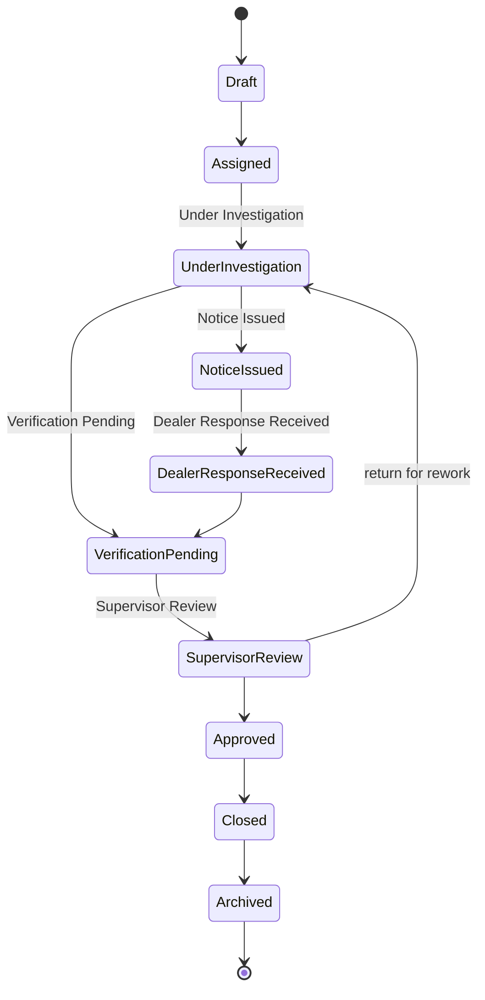

# Workflow Engine

The GAIS workflow engine enforces valid audit case status transitions.

## State Machine



## Valid Transitions

| From | Allowed To |
|------|------------|
| Draft | Assigned |
| Assigned | Under Investigation |
| Under Investigation | Notice Issued, Verification Pending |
| Notice Issued | Dealer Response Received |
| Dealer Response Received | Verification Pending |
| Verification Pending | Supervisor Review |
| Supervisor Review | Approved, Under Investigation |
| Approved | Closed |
| Closed | Archived |
| Archived | (terminal) |

## Implementation

- Module: `backend/services/workflow_engine.py`
- `validate_transition(from, to)` raises `WorkflowTransitionError` on invalid moves
- `allowed_transitions(current)` returns permitted next states
- All transitions recorded in `workflow_history` and `case_timelines`

## Usage

```python
from services.workflow_engine import validate_transition

validate_transition("Draft", "Assigned")  # OK
validate_transition("Draft", "Closed")      # raises WorkflowTransitionError
```

API: `POST /api/audit-cases/{id}/transition` with `{ "session_id", "to_status", "reason", "actor" }`

Query allowed transitions: `GET /api/audit-cases/{id}/transitions?session_id=...`

## Business Rules

- Assignment from Draft automatically transitions to **Assigned**
- Notice issue from Under Investigation transitions to **Notice Issued**
- Dealer response recording transitions from Notice Issued to **Dealer Response Received**
- Supervisor approval requires status **Supervisor Review**
- Archived cases are read-only
